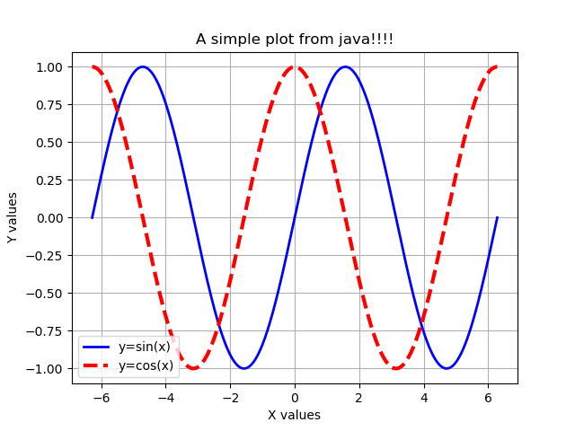

# pyplot4j
A nice __static__ java wrapper for matplotlib.pyplot

## Introduction

The plotting library of _matplotlib_ is one the most powerful and easy to use libraries ever created.
Although it is possible to implement a similar library purely in java, it also makes sense to simply use the capabilities of the *matplotlib*.
To this end, this repository aims at providing a java framework that can easily generate the _python_ code necessary for drawing the plots.
After the python code is generated, the framework will execute a terminal (commandline) command **"python file_name.py"** and a window will open with the drawn plots.

The original documentation of **matplotlib** can be found here: [Matplotlib Documentation](https://matplotlib.org/Matplotlib.pdf)

## Current Capabilities
* XYPlot
   * this is similar to executing _plt.plot(x, y, *args, **kwargs)_ in python. XYPlot resembles a _Figure_ object in _matplotlib_.
* XYSubPlot
   * this is similar to executing _plt.subplot(row, column, index)_ first and then _plt.plot(x, y, *args, **kwargs)_ in _matplotlib_.
* PolarPlot
   * this is similar to executing a plot with _projection='polar'_ keyword argument.
* ContourPlot
   * this is similar to executing _plt.contour(X, Y, Z, labels=[])_. The contour labels can be set in a similar way to _plt.clabel(**kwargs)_.
   An interface called "MeshGrid.java" is provided to generate the Z data points.
   ```java
   public interface MeshGrid {
	double value(double x, double y) ;
	}
   ```

## Visual Guide to Matplotlib


## XYPlot
As the name suggests, this provides a simple API to draw plots in XY cartesian coordinates.
The step-by-step guide is as follows (see __Example1.java__):

* Step 0: create some data. Let's plot y=sin(x) and y=cos(x) over the [-2pi, 2pi] interval.
```java
// step 0
double[] x = MathUtils.linspace(-2.0*Math.PI, 2.0*Math.PI, 1000) ;
double[] y1 = Arrays.stream(x).map(Math::sin).toArray() ;
double[] y2 = Arrays.stream(x).map(Math::cos).toArray() ;
```

* Step 1: create an XYPlot instance and plot the first curve y=sin(x). The java code is based on the builder design pattern which means it is possible to change multiple commands one after another.
The "plot()" method returns an XYSeries object which is used to set properties such as "marker", "color", "linestyle", etc.
```java
// step 1
XYPlot plt = new XYPlot("A simple plot from java!!!!") ;
plt.plot(x, y1).color("b").linestyle("-").linewidth(2.0).label("y=sin(x)") ;
```

* Step 2: now plot the second curve y=cos(x) by invoking the "plot()" method on the same XYPlot. This returns a __new__ XYSeries which can be configured for this curve.
```java
// step 2
plt.plot(x, y2).color("r").linestyle("--").linewidth(2.0).label("y=cos(x)") ;
```

* Step 3: now that we're done with the curves, let's configure the plot itself. Let's add xlabel and ylabel, make the legend and grids visible, also ask the plot to use _tight_layout()_ to automatically calculate the best dimesions.
```java
// step 3
plt.xlabel("X values").ylabel("Y values").legend(true).grid(true) ;
```

Here's an example:



## XYSubPlot


## PolarPlot


## ContourPlot


